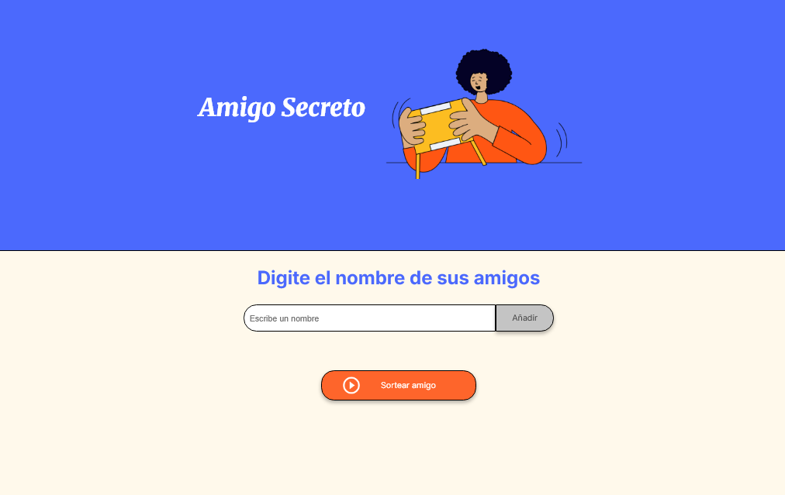
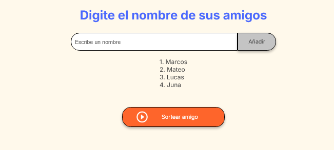
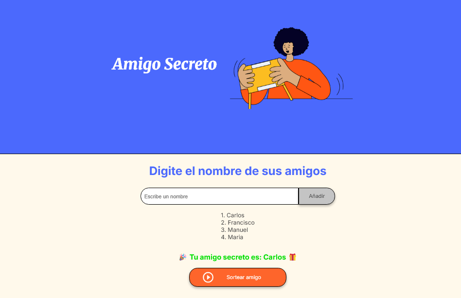

# 🎁 Amigo Secreto  

<p align="left"> 
   
   
   
</p>

> Aplicación web interactiva en HTML, CSS y JavaScript para ingresar nombres de amigos y realizar un sorteo aleatorio que determine quién es el **“amigo secreto”**.

---

## 🌐 Demo en Vivo  

**¡Prueba directamente la aplicación en tu navegador!**  
[](#)  

---

## 🔍 Tabla de Contenidos
1. [Descripción](#-descripción)
2. [Contexto del Proyecto](#-contexto-del-proyecto)
3. [Características](#-características)
4. [Vista Previa](#-vista-previa)
5. [Capturas](#-capturas)
6. [Tecnologías Utilizadas](#-tecnologías-utilizadas)
7. [Estructura del Proyecto](#-estructura-del-proyecto)
8. [Aprendizajes](#-aprendizajes)
9. [Autor](#-autor)

---

## 📌 Descripción  
**Amigo Secreto** es una aplicación web sencilla y divertida que permite a los usuarios:  

- Ingresar nombres de amigos en una lista  
- Validar que los nombres no estén vacíos ni duplicados  
- Visualizar los nombres en pantalla  
- Realizar un sorteo aleatorio para elegir al **amigo secreto** 🎲  

---

## 🎓 Contexto del Proyecto  
Desarrollado como práctica de manipulación del DOM con **JavaScript**, enfocada en reforzar habilidades de validación, generación de resultados aleatorios y diseño de una interfaz accesible y clara.  

---

## 🚀 Características  
- ➕ **Agregar nombres** mediante un campo de texto y botón.  
- ⚠️ **Validación de entradas** (no se aceptan vacíos ni duplicados).  
- 📜 **Lista visible** de los nombres agregados.  
- 🎲 **Sorteo aleatorio** para determinar al amigo secreto.  
- 🎨 Interfaz amigable y responsiva.  

---

## 🖼️ Vista Previa  

<p align="center">
  
  
  
</p>

---

## 🛠 Tecnologías Utilizadas  
- **HTML5** – Estructura principal de la aplicación  
- **CSS3** – Estilos y diseño visual  
- **JavaScript (ES6+)** – Lógica de validación, renderizado dinámico y sorteo  

---

## 📂 Estructura del Proyecto  
```plaintext
.
├── index.html        # Estructura principal
├── style.css         # Estilos y diseño
├── app.js            # Lógica de validación y sorteo
└── assets/           # Recursos (imágenes, íconos, previews)
